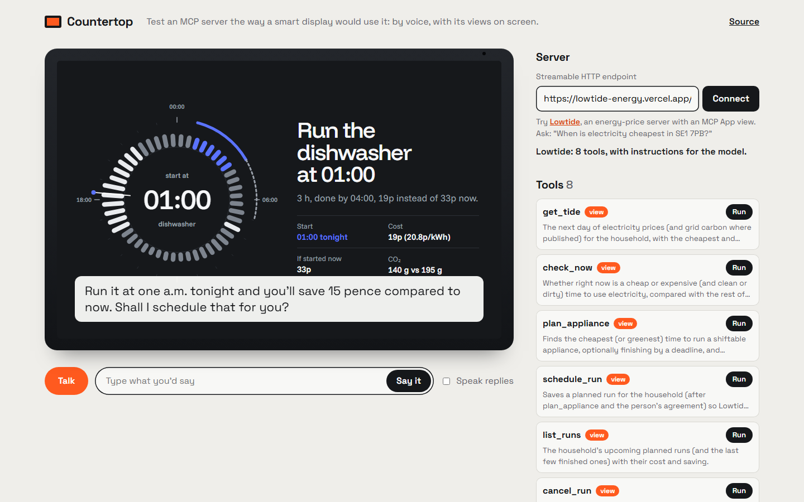
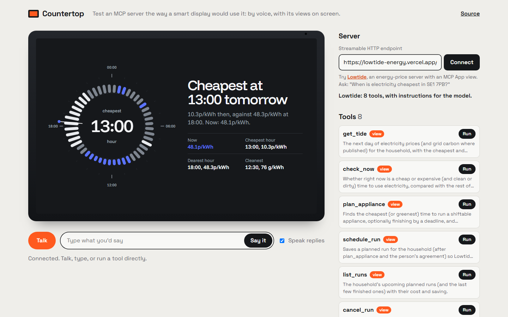

# Countertop

**Test an MCP server the way a smart display would use it: by voice, with its views on screen.**

Paste any remote MCP server (Streamable HTTP). Countertop connects from the browser, lists the tools, and lets you talk to the server the way Alexa+ on an Echo Show would: the model picks a tool, Countertop runs it over MCP, speaks the reply, and draws the tool's **MCP App view** full screen on a 16:10 device display.

**Live:** https://countertop-mcp.vercel.app · try it with [Lowtide](https://countertop-mcp.vercel.app/?server=https://lowtide-energy.vercel.app/api/mcp)



## Why

Alexa+ integrations are MCP servers, but outside developers can't yet try their server on a real device. What changes on a device is exactly what's hard to test in a chat window:
- the answer has to work **spoken**, in one or two sentences;
- the view has to fit a **fixed screen** with no scrolling, readable from across a room;
- the model has to pick the right tool from **natural, half-formed speech**.

Countertop is a test bench for that, built while making [Lowtide](https://github.com/RohanGlitched/lowtide) for the Amazon Build, Ship, Shape hackathon, and pulled out so any MCP author can use it.

## What it does

- **Connects to any Streamable HTTP MCP server** from the browser (the server must allow CORS). Reads its tools, its `ui://` views and its instructions.
- **Voice in, voice out.** Push to talk with the Web Speech API (Chrome, Edge, Safari), or type. Replies are spoken with the browser's voices.
- **A real model loop.** Each turn goes to Claude Haiku 4.5 on **Amazon Bedrock** (Converse API) with the server's tool list and instructions; Countertop runs the tool calls itself and loops until the model answers.
- **MCP Apps on a device screen.** Tool views render in an opaque-origin sandboxed iframe through the official `AppBridge`, with `displayMode: "fullscreen"` and the screen's size in the host context, so your view can switch to its device layout.
- **A tool console.** Run any tool by hand with JSON arguments (started from the schema's defaults, enums and "e.g." hints) and see its view, with no model at all.
- **The Alexa light bar** along the bottom of the screen shows listening, thinking and speaking.



## Run it

```bash
npm install
npm run dev            # http://localhost:5173 (tool console works; the model needs the function below)
```

The model turn lives in [`api/turn.mjs`](api/turn.mjs), a Vercel function. Deploy with `vercel`, and set:

| Variable | |
|---|---|
| `AWS_BEARER_TOKEN_BEDROCK` | A Bedrock API key (us-east-1 by default). Without it, Countertop runs as a tool console. |
| `BEDROCK_MODEL` | Default `us.anthropic.claude-haiku-4-5-20251001-v1:0` |
| `BEDROCK_REGION` | Default `us-east-1` |
| `DAILY_MODEL_CAP` | Model calls per day (default 300), plus 30 per visitor per 10 minutes |

Open `/?server=<url>` to connect straight to a server.

## Making your server Countertop-friendly

- Allow CORS on the MCP endpoint (`Access-Control-Allow-Origin`, and `content-type, mcp-session-id, mcp-protocol-version` in the allowed headers), and answer `OPTIONS`.
- Return a short spoken sentence as the first text content of each tool result; put anything the model needs but shouldn't say in a later line.
- In your MCP App view, read `hostContext.displayMode` and `containerDimensions`: in `fullscreen`, fit the screen without scrolling.

## Security and privacy

- Countertop runs in your browser and talks to the server you give it; nothing is stored except the last server URL in `localStorage`.
- The model function answers requests whose Origin is its own page, caps calls per visitor (30 per 10 minutes) and per day (300 by default), both per server instance. That stops casual reuse of a public deployment's Bedrock key; it is not authentication, so a deployment with real money behind it should add its own.
- A server's `instructions` are passed to the model inside the system prompt, fenced as untrusted text, which is what a real host does. A server can still steer the model, so Countertop is a test bench for servers you are building or trust. Tools that aren't marked read-only ask you in the browser before they run, whatever the model or the server say.
- Views run in a sandboxed iframe with an opaque origin and scripts only; they cannot read the page or your other tabs.

## How it's built

- `src/host.ts`: MCP client (`@modelcontextprotocol/client` v2) and the MCP Apps host (`@modelcontextprotocol/ext-apps/app-bridge`).
- `src/main.ts`: the conversation loop, the tool console and the device UI.
- `src/voice.ts`: speech recognition and synthesis.
- `api/turn.mjs`: one Bedrock Converse turn with spend guards.

## Contributing

Issues and pull requests are welcome; see [CONTRIBUTING.md](CONTRIBUTING.md) for setup, checks and a list of good first contributions.

MIT licensed.
